import { Steps } from '@astrojs/starlight/components';
import BugsDisclaimer from '../../../components/BugsDisclaimer.astro';

<BugsDisclaimer />

Accept - это цифровой образовательный ресурс для
автоматизации обучения программированию, который

- Автоматизирует проверку и поиск AI-плагиата
- Дает персонализированные AI-подсказки об ошибках
- Генерирует задачи и материалы
- Упрощает создание курсов и турниров

Accept разработан в соответствии с запросами и рекомендациями **опытных российских преподавателей**.

## Авторизация
<Steps>
1. Пререйдите на страницу входа.
    
2. Выберите организацию.
    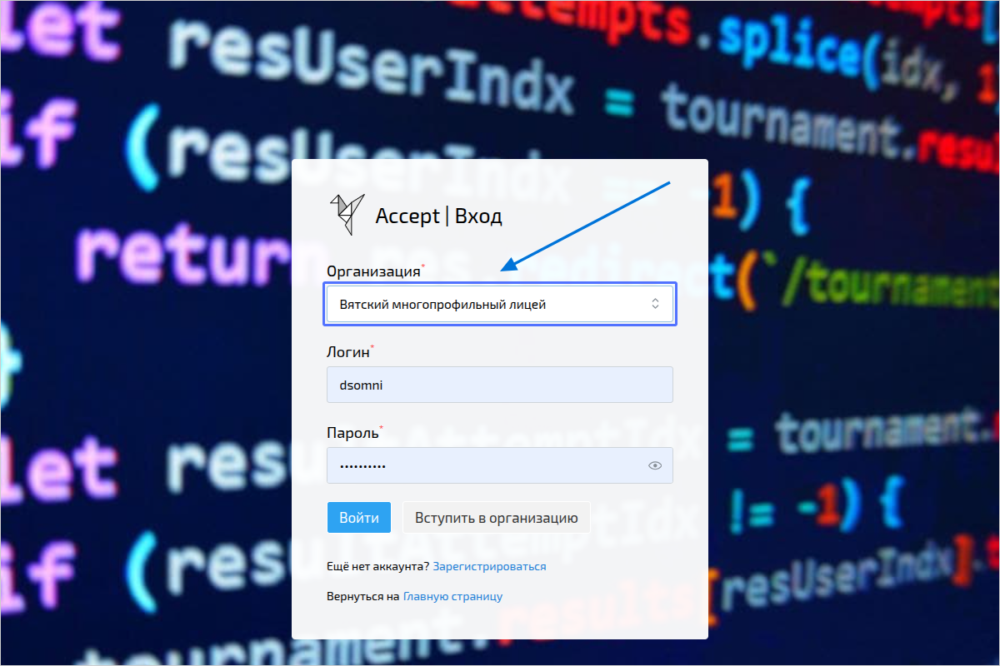
    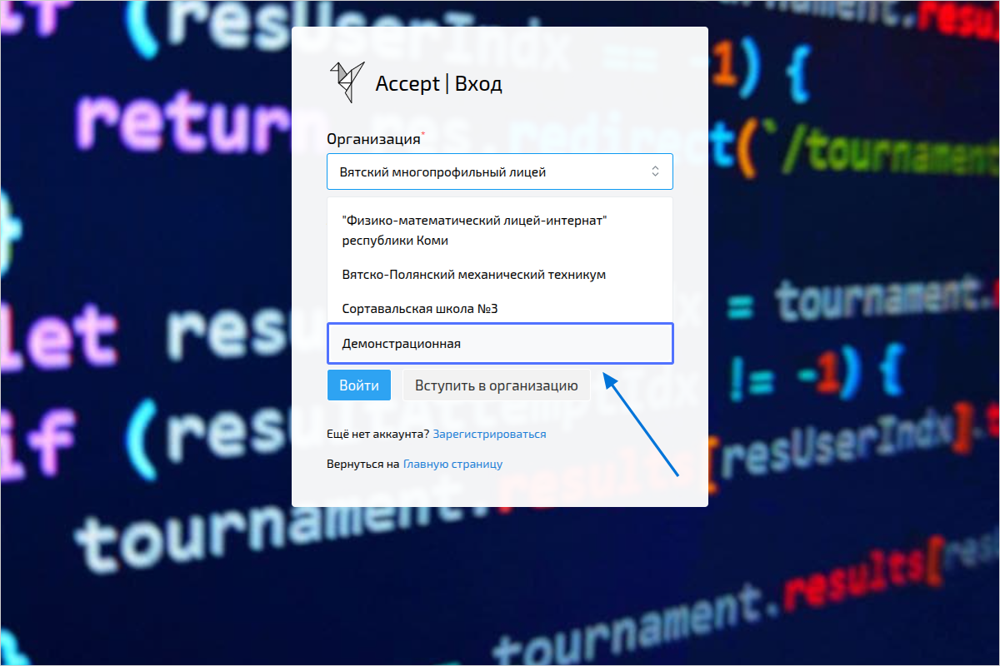
3. Ведите логин и пароль
    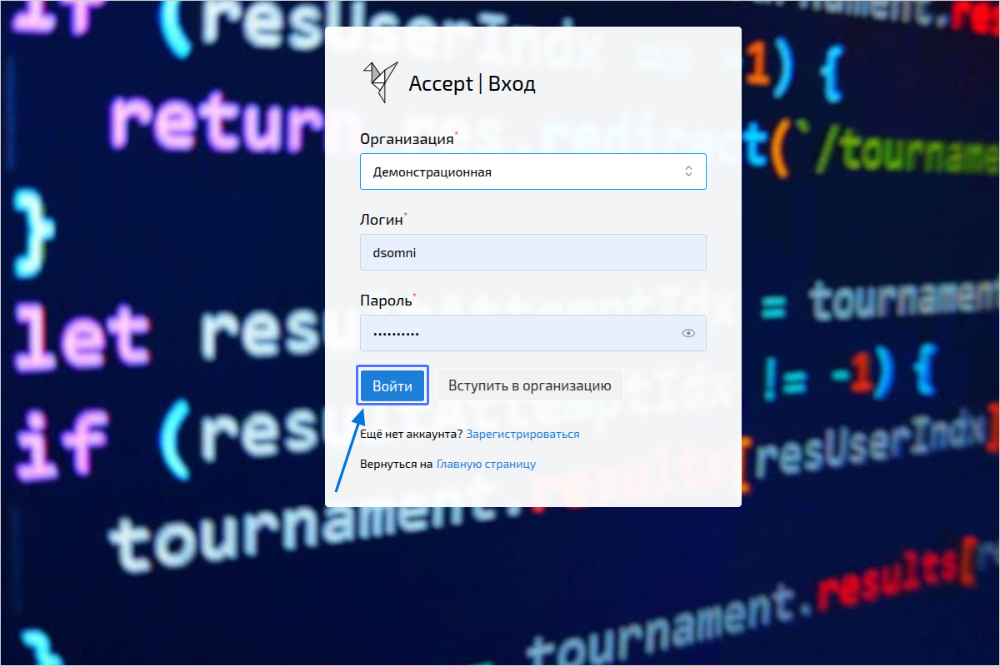
    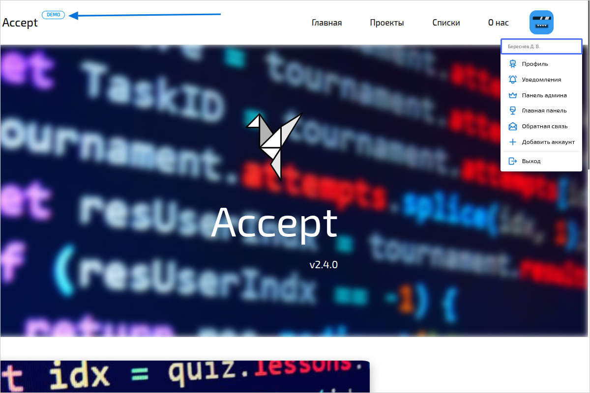
</Steps>

## Регистрация
<Steps>
1. Пререйдите на страницу входа.
    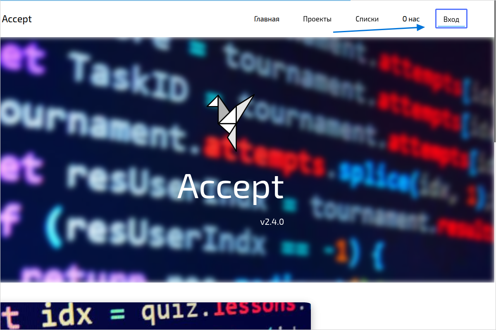
2. Нажмите на кнопку **Зарегистрироваться**.
    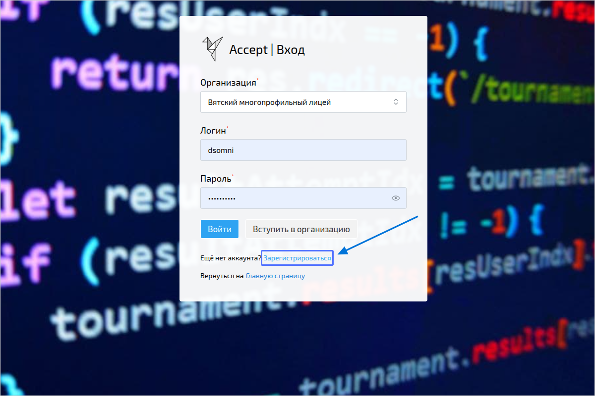
3. Выберите организацию
    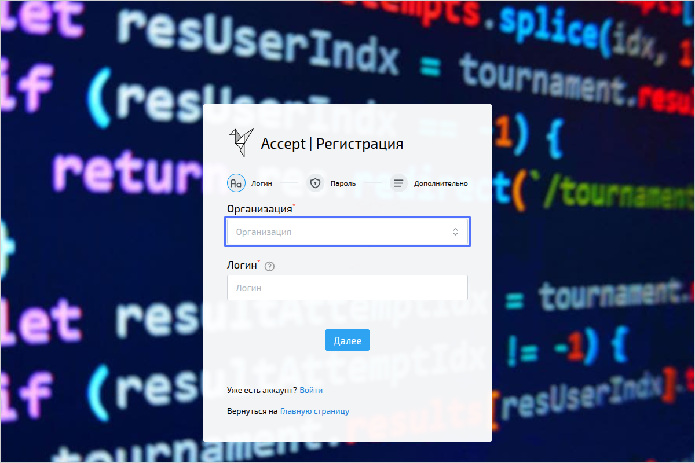
    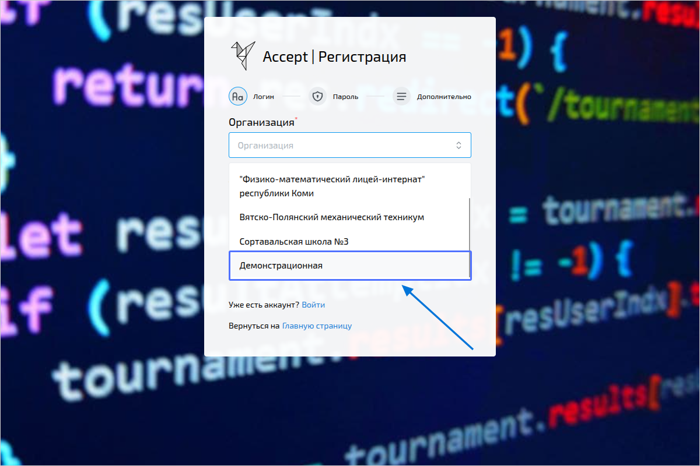
4. Придумайте логин
    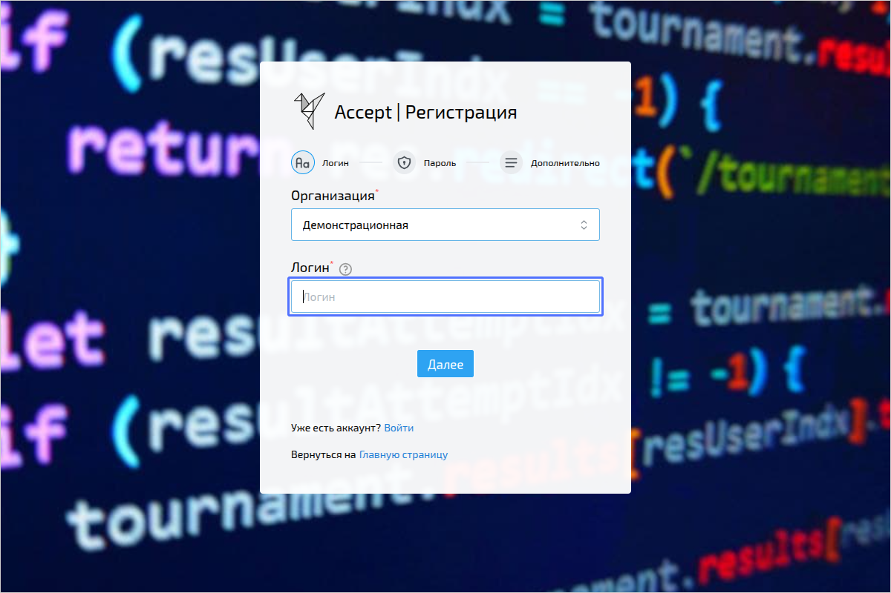
    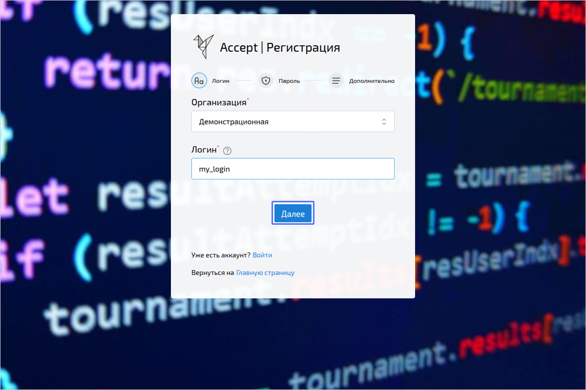
5. Придумайте пароль и подтвердите его
    :::note
    Пароль может содержать латинские буквы, цифры и символы:
    :::
    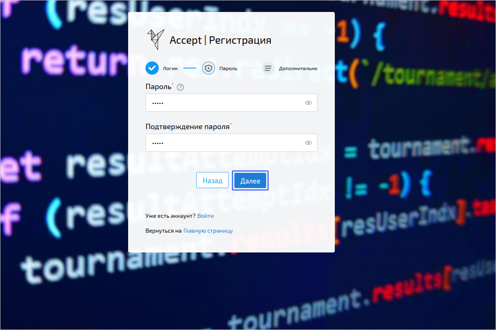
6. Введите свои ФИО и электронную почту
    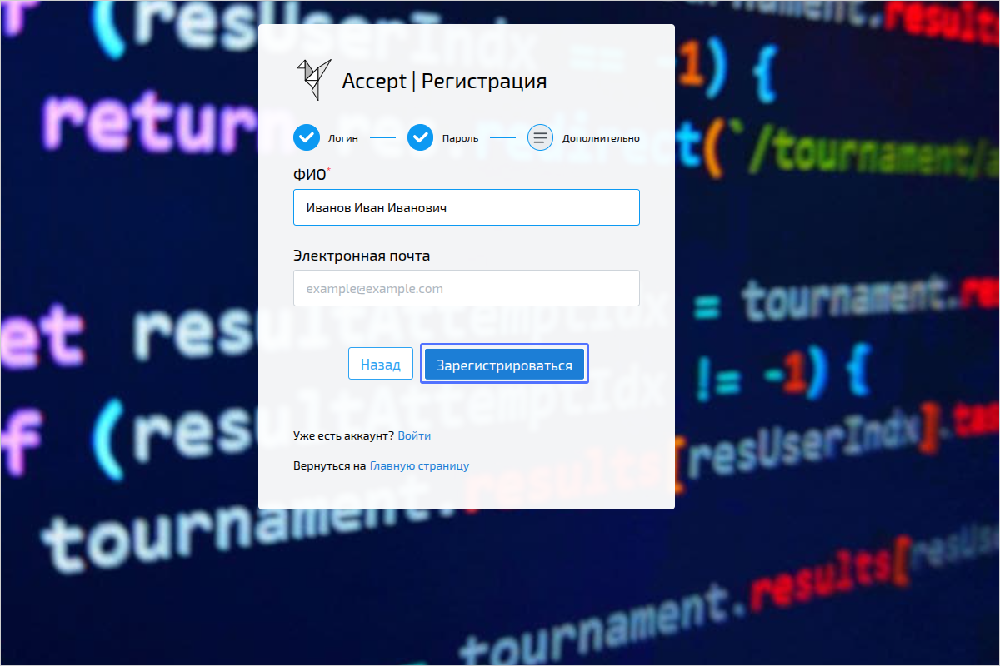
</Steps>
