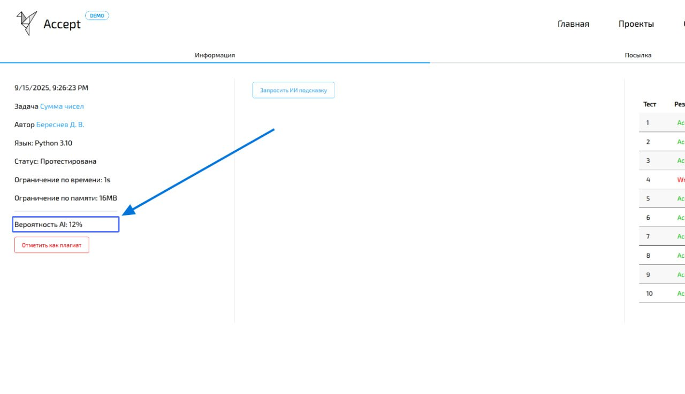
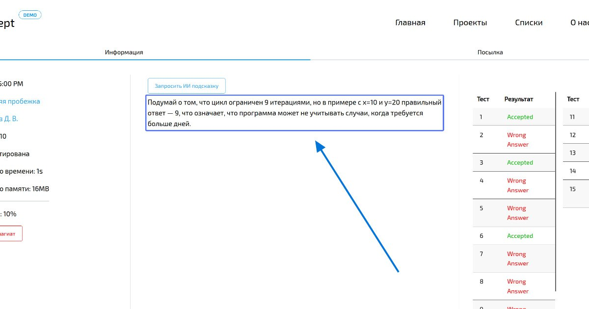
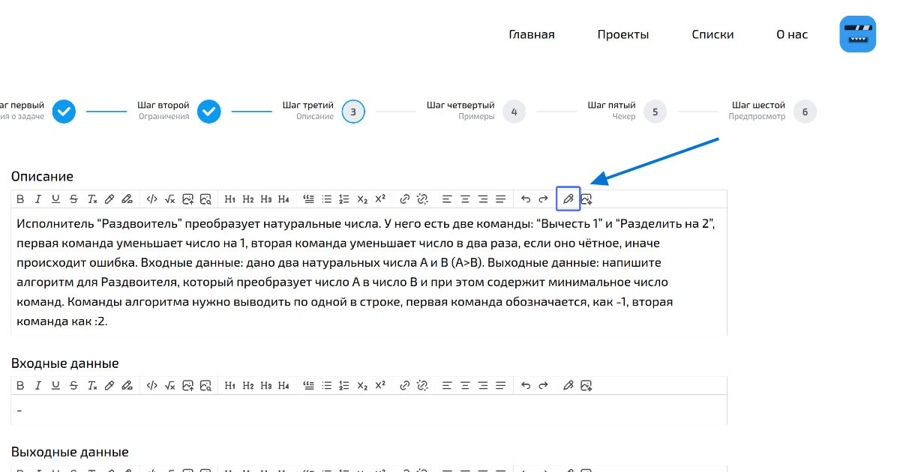
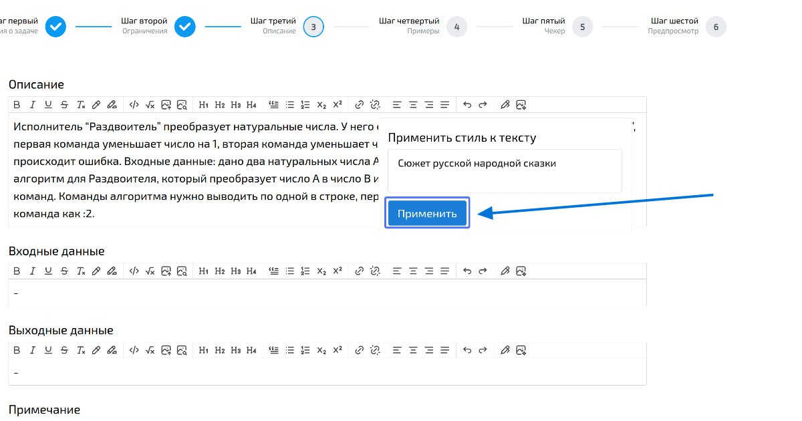
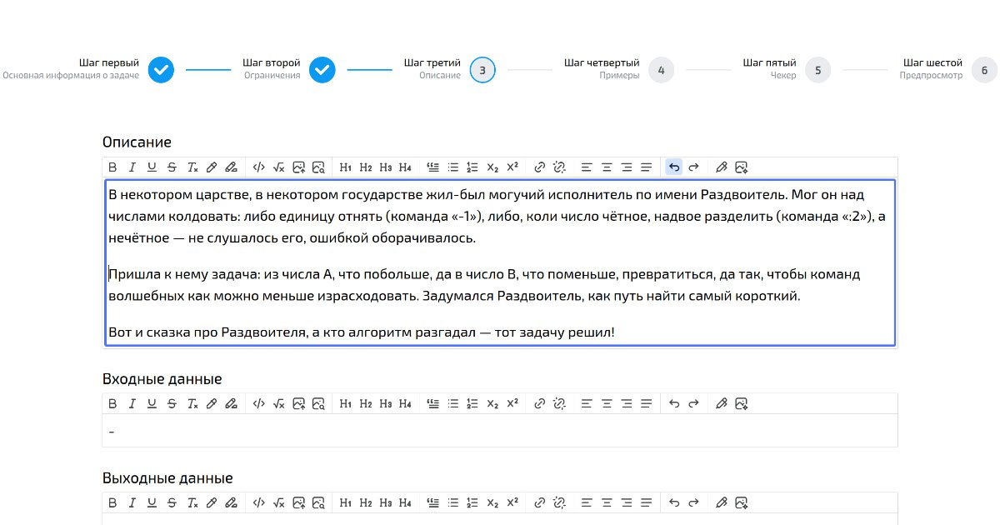
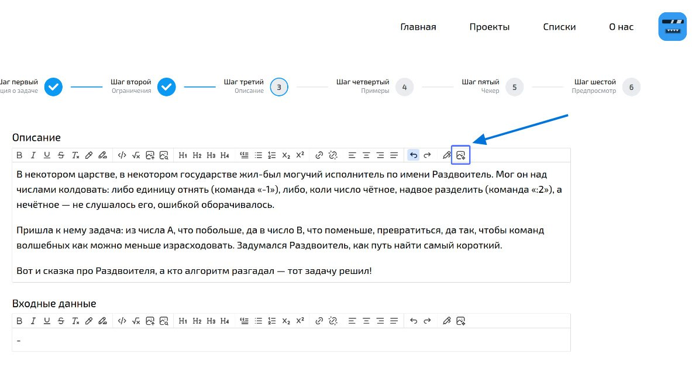
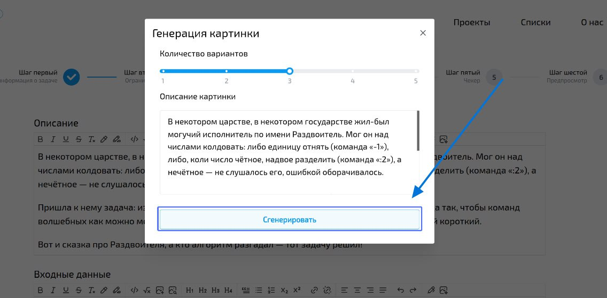
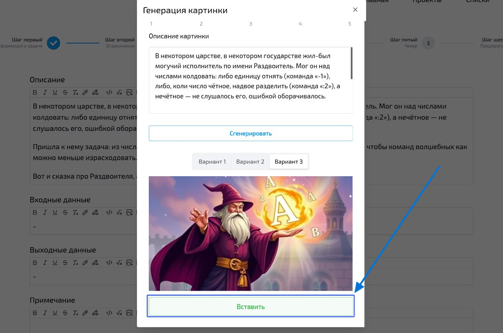
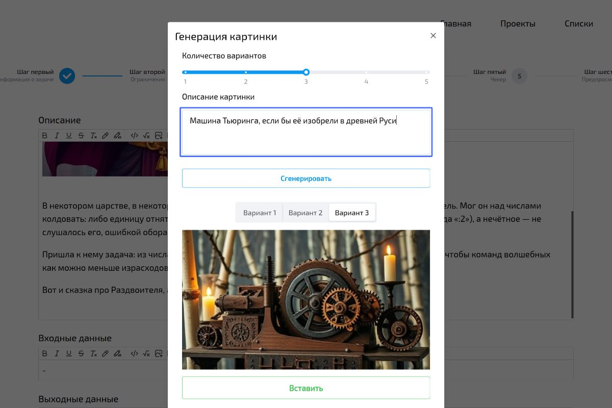

import BugsDisclaimer from '../../../components/BugsDisclaimer.astro';
import { Steps } from '@astrojs/starlight/components';

<BugsDisclaimer />

Система Accept использует **искусственный интеллект (ИИ)**, чтобы помочь вам экономить время и создавать более качественные учебные материалы. Это руководство покажет вам, как применять ИИ в вашей работе.

## Проверка на использование ИИ учениками

Система автоматически анализирует **все отправленные решения** на предмет возможной генерации с помощью ИИ.

**Как это использовать:**
1.  Перейдите на страницу любой попытки ученика.
2.  Найдите блок **«Вероятность ИИ-плагиата»**.
3.  Ознакомьтесь с процентом. Чем он выше, тем выше вероятность, что код был сгенерирован ИИ.

:::caution[Важно!]
Высокий процент (даже 99.9%) — это **вероятность**, а не абсолютная гарантия.
*   **Не используйте этот показатель как единственное доказательство** списывания.
*   Всегда **проведите дополнительную беседу** с учеником, чтобы выяснить, понимает ли он сданный код.
:::

## Генерация подсказок для учеников

Если ученик застрял на решении, он может мгновенно создать для себя персонализированную подсказку.

:::note
Генерация подсказок доступна только для обычных задач. Например, невозможно сгенерировать подсказку для турнирной задачи.
:::

**Как создать подсказку:**
<Steps>
1.  На **странице попытки** ученика найдите и нажмите кнопку **«Сгенерировать подсказку»**.
2.  ИИ проанализирует условие задачи и код ученика.
3.  Система предложит вариант подсказки, который укажет на возможную ошибку или направит мысль в нужное русло.

    
</Steps>

:::tip[Когда это полезно?]
*   **Если попытка неудачная:** ИИ предложит идею, в каком направлении искать ошибку.
*   **Если попытка успешная:** ИИ даст рекомендации по улучшению кода (оптимизация, читаемость).
:::

## Оформление условий задач с помощью ИИ

ИИ помогает вам создавать понятные и визуально привлекательные формулировки задач.

### Стилизация текста

Используйте ИИ, чтобы улучшить читаемость текста: сделать его более строгим, академичным или, наоборот, простым и дружелюбным.

<Steps>
1.  В **текстовом редакторе** (например, при создании задачи) нажмите на иконку **«Стилизовать текст»** (иконка ручки).
    
2.  В открывшемся окне **опишите желаемый стиль** (например, «Сделай текст более формальным» или «Упрости формулировку для 5 класса»).
    
3.  Нажмите «Применить», и ИИ преобразует текст.
    
</Steps>

:::tip[Совет]
Всегда **просматривайте и редактируйте** результат. ИИ — это помощник, а не автор. Убедитесь, что смысл остался точным.
:::

### Генерация иллюстраций

Добавьте уникальные изображения к условиям задач, чтобы сделать их нагляднее.

<Steps>
1.  В **текстовом редакторе** нажмите на иконку **«Сгенерировать изображение»** (крайняя справа).
    
2.  В открывшемся окне **детально опишите, что вы хотите увидеть на картинке**. Чем точнее запрос, тем лучше результат.
    
3.  Система предложит **несколько вариантов** изображений. Выберите тот, который лучше всего подходит.
    
</Steps>

:::note[Как составлять запросы?]
*   Запросом считается **весь текст в поле описания**.
*   Вы можете **игнорировать исходный текст** задачи и написать свой собственный, более точный запрос для генерации.
    
:::