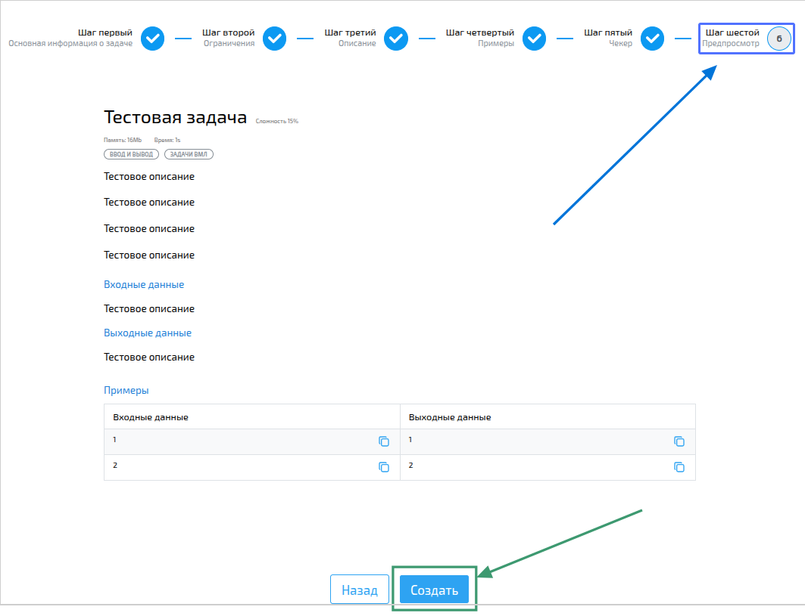

import { Steps } from '@astrojs/starlight/components';
import BugsDisclaimer from '../../../components/BugsDisclaimer.astro';

<BugsDisclaimer />

Это руководство шаг за шагом проведет вас через процесс создания вашей первой задачи. К концу прохождения у вас будет новая задача, готовая для ваших учеников!

:::note[Права доступа]
Все учителя в вашей организации могут создавать и редактировать задачи.
:::

## Два основных этапа

Создание задачи состоит из двух простых шагов:
1.  **Добавление информации о задаче:** Определите условие, установите ограничения и напишите инструкции.
2.  **Добавление тестов:** Предоставьте секретные входные данные и правильные ответы, которые система будет использовать для автоматической проверки решений учеников.

Это руководство охватывает **Шаг 1**. После того как вы создадите задачу, вы всегда сможете [отредактировать ее тесты позже](/recipes/first-test).

## Пошаговая инструкция: Создание задачи

<Steps>
1.  **Перейдите на страницу добавления задачи.**
    *   На [странице списка задач](/references/tasks/overview) нажмите кнопку добавления новой задачи.

    

2.  **Заполните основную информацию.**
    Это основа вашей задачи. Будьте ясны и описательны!
    *   **Название задачи:** Выберите название, которое легко идентифицирует проблему (например, «Сумма двух чисел»).
    *   **Теги:** Выберите хотя бы один тег, чтобы позже было проще найти эту задачу.
    :::tip
    Не можете найти подходящий тег? Вы можете создать новый прямо здесь!
    :::
    *   **Сложность:** Установите субъективный уровень сложности от 1 (самая простая) до 100 (самая сложная).
    *   **Тип задачи и тестирования:** Выберите тип задачи. Для вашей первой задачи отлично подходит тип «Стандартная».
    *   **Подсказка:** Решите, хотите ли вы создать подсказку для учеников, которые застряли.

    

3.  **Установите ограничения для программы.**
    Эти правила не позволяют коду учеников выполняться вечно или использовать слишком много ресурсов.
    *   **Ограничение по времени:** Установите максимально допустимое время работы (в секундах).
    *   **Ограничение по памяти:** Установите максимально допустимое использование памяти (в мегабайтах).
    *   **Ограничения по языкам:** (Опционально) Вы можете разрешить или заблокировать определенные языки программирования.

    

4.  **Напишите условие задачи.**
    Это то, что увидят ваши ученики. Будьте понятны!
    *   Напишите условие задачи в поле **Описание**.
    *   Объясните, какие данные программа должна читать, в поле **Формат входных данных**.
    *   Объясните, какие данные программа должна выводить, в поле **Формат выходных данных**.
    *   Используйте поле **Примечание** для любой дополнительной информации.
    :::tip[Профессиональный совет:]
    Используйте встроенный редактор для форматирования текста. Вы даже можете использовать ИИ-инструменты, чтобы помочь создать четкие описания и примеры!
    :::

    

5.  **Добавьте хотя бы один пример.**
    Примеры помогают ученикам понять задачу. Вы можете добавить сколько угодно примеров с помощью кнопки `+`.
    *   Укажите пример **Входных** данных.
    *   Укажите правильный **Вывод** для этих данных.

    

6.  **Проверьте и нажмите «Создать»!**
    *   Просмотрите превью, чтобы убедиться, что всё выглядит правильно.
    *   Нажмите кнопку **Создать**, чтобы завершить!

    
</Steps>

🎉 **Поздравляем!** Вы создали свою первую задачу. Теперь она появится в [вашем списке задач](/references/tasks/overview).

## Что дальше?

Задача создана, но ей нужны тесты для автоматической оценки ответов учеников.

1.  Перейдите на страницу вашей новой задачи. Вы можете найти её в [списке задач](/references/tasks/overview).
2.  В правом нижнем углу нажмите на значок меню (`...`).
3.  Выберите в меню пункт «Редактировать тесты».
4.  Следуйте нашему руководству [Как добавить тесты к задаче](/recipes/first-test), чтобы завершить настройку!

:::tip[Ура!]{icon="star"}
Вы только что сэкономили время на проверке! Теперь, когда ученик отправит решение, система мгновенно проверит его по вашим тестам и выставит оценку.
:::