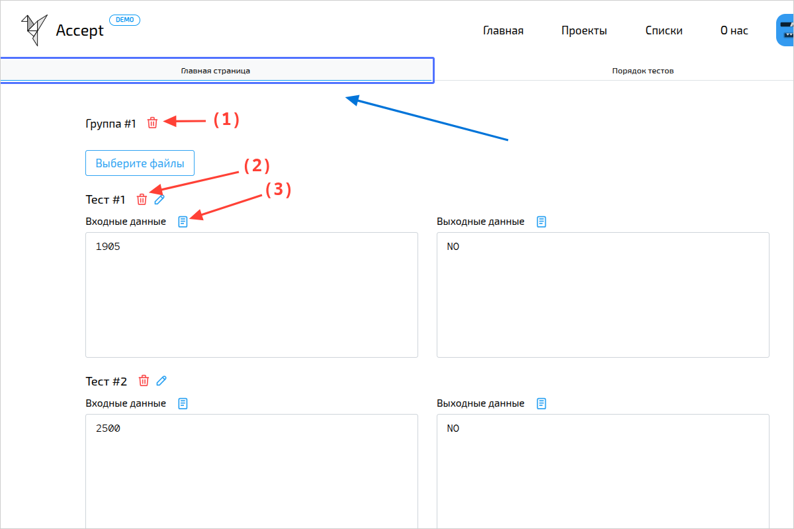
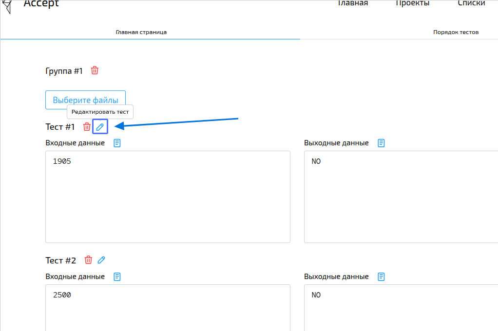

import { Steps } from '@astrojs/starlight/components';

Тесты — это секретные входные данные и правильные ответы, которые система использует для проверки решений учеников. Без тестов задача не будет работать.
:::note[Права доступа]
Все учителя в вашей организации могут создавать и редактировать задачи.
:::

## Два основных этапа

Создание задачи состоит из двух простых шагов:
1.  **Добавление информации о задаче:** Определите условие, установите ограничения и напишите инструкции.
2.  **Добавление тестов:** Предоставьте секретные входные данные и правильные ответы, которые система будет использовать для автоматической проверки решений учеников.

Это руководство охватывает **Шаг 2**. Если вы ещё не создали задачу, то перейдите к [шагу 1](/recipes/first-task).

## Пошаговая инструкция: Редактирование тестов

<Steps>
1.  **Откройте редактор тестов.**
    *   На странице нужной задачи нажмите на меню (`...`) в правом нижнем углу и выберите **«Редактировать тесты»**.

    
    {/* TODO: add image with add button */}
2.  **Работайте на вкладке "Главная страница".**
    Здесь вы управляете тестами:
    *   **Добавьте группу тестов:** Группы помогают организовать тесты по сложности или сценариям (например, "Основные примеры", "Угловые случаи").
    *   **Добавьте тест в группу:** Для каждого теста укажите:
        *   **Входные данные (Input):** что программа ученика получит на вход.
        *   **Выходные данные (Output):** что она должна вывести в ответ.
    *   **Редактируйте и удаляйте:** Вы можете изменять любые тесты или удалять их.

    :::tip
    Если тест очень большой, он откроется в новой вкладке для удобства редактирования.
    :::

    
    

3.  **(Опционально) Настройте порядок на вкладке "Порядок тестов".**
    *   Меняйте порядок групп и отдельных тестов простым перетаскиванием.
    *   Перемещайте тесты между группами.

    
</Steps>

{/* ✅ **Готово!** Теперь ваша задача полностью настроена. Ученики могут отправлять решения, а система будет их автоматически проверять. */}

:::tip[Готово!]{icon="approve-check"}
Теперь ваша задача полностью настроена. Ученики могут отправлять решения, а система будет их автоматически проверять.
:::