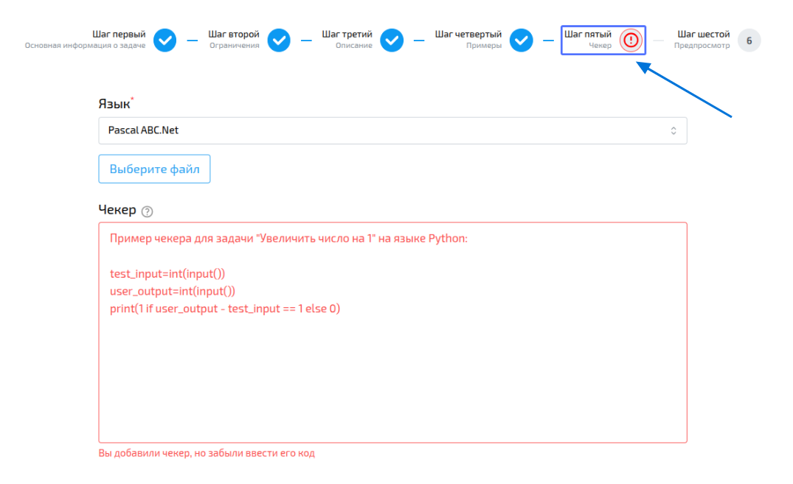

import { Steps } from '@astrojs/starlight/components';
import BugsDisclaimer from '../../../../components/BugsDisclaimer.astro';

<BugsDisclaimer />

На этой странице подробно описываются параметры,
доступные к заполнению на странице добавления/редактирования задачи.

## Параметры задачи
### Название
Название задачи — строка длиной не менее 5 символов;
название задачи должно быть уникальным.

### Теги
Теги это созданные учителями метки, помогающие организовывать библиотеку задач.
Задача должна иметь по крайней мере один тег, верхнего предела количества тегов нет.

На странице добавления/редактирования задачи вы можете добавлять, редактировать и удалять теги.
Инструкции о том как работать с тегами вы можете найти на [странице](/references/utilities/tags).

Теги помогают пользователям искать искать вашу задачу,
так же тег может подсказать пользователю направление в котором стоит размышлять.

### Сложность
Сложность это субъективная оценка сложности

:::tip
Если средний школьник способен решить эту задачу без затруднений,
то рекомендуется оценить эту задачу в 15%
:::

Сложность позволяет ученикам найти задачи по собственному уровню,
а учителям быстро понимать стоит ли добавлять задачу в уроку.

### Тип задачи
Классификация задачи по ответу пользователя:
- В качестве решения **Текстовой задачи** пользователь отправляет только ответ - текстовую строку.
- **Задача со сдачей кода** подразумевает, что пользователь сдаёт код в качестве решения.

:::note
В качестве решения **текстовой задачи** пользователь будет отправлять столько же ответов,
сколько существует тестов для этой задачи.
:::

### Тип тестирования
Классификация задачи по способу тестирования:
- **Чекер** — автор задачи предоставляет входные данные и программу проверяющую ответ пользователя.
Подробнее о чекере вы можете прочесть в разделе [Что такое чекер?](#что-такое-чекер).
- **Тесты** — автор задачи предоставляет тесты (пары из входных данных и ожидаемого ответа пользователя).

:::note
В случае выбора комбинации **текстовая задача** и **Тесты** автор предоставляет только выходные данные для тестов.
:::

### Подсказка
Подсказка это текст, который должен помочь пользователю решаить задачу.

В случае добавления подсказки к задаче, система запросит у вас [текст подсказки](#текст-подсказки),
[вид триггера подсказки](#вид-триггера-подсказки) и [условие](#показать-подсказку-после) при котором подсказка будет показана.

{/* ### Учебная */}
{/* TODO */}

### Ограничить используемые языки
Вы можете ограничить языки, которые будут доступны пользователям при сдаче решения данной задачи
- Если выбрана опция "Разрешённые", то будут доступны только выбранные языки
- Если выбрана опция "Запрещённые", то будут доступны все языки, кроме выбранных
- Если вы не ограничиваете используемые языки, то будут доступны все

### Память
Ограничение оперативной памяти (в МБ) испольуемой во время работы программы.
Если предел памяти будет превышен, то пользователь получит ошибку [ML](/references/tasks/attempts/additional/#ml).

### Время
Ограничение времени (в секундах) которое программа может работать.
Если программа пользователя работала дольше предела, то она будет остановлена и пользователь получит ошибку [TL](/references/tasks/attempts/additional/#tl).

### Описание
Текст описывающий, что должна делать программа пользователя.
Формулировка задачи может содержать картинки, математические формулы, ссылки.

Длина описания должна составлять не менее 20 символов (включая сиволы форматирования, но не включая пробелы и пустые строки в начале и конце описания).

### Входные и выходные данные
Описание формата входных и выходных данных. Обязательные к заполнению поля.

:::tip
Не забывайте, что пользователи могут использовать различные языки программирования,
поэтому рекомендуется четко описывать пределы чисел во входных данных,
и число знаков после запятой в выходных данны, если ответ ожидается в виде `float` числа.
:::

### Примечание
Текст примечания будет отображен в самом конце страницы задачи.
Используйте примечание для уточнения формулировки или разбора примеров к задаче.

### Текст подсказки
:::note
Это поле доступно, только при выборе опции [подсказка](#подсказка)
:::

Текстовое поле которое будет показано пользователю при выполнении условий.
При выборе подсказки это поле обязательно.

### Вид триггера подсказки
:::note
Это поле доступно, только при выборе опции [подсказка](#подсказка)
:::
- **Попытки** подсказка будет показана после отправки пользователем заданного числа попыток.
- **Время** подсказка будет показана, когда пройдет заданное время после первой попытки отправленной пользователем.

### Показать подсказку после
:::note
Это поле доступно, только при выборе опции [подсказка](#подсказка)
:::

Число попыток или минут, после которых подсказка будет показана пользователю.

### Примеры
Примеры данных которые будут поданы пользователю,
и пример ожидаемого ответа от пользователя.

Задача должна иметь хотя бы один пример. Вы можете добавить произвольное количество задач с помощью кнопки `+`.

:::tip
Хотя задача может иметь лишь один пример, чаще всего одного примера недостаточно.
Примеры иллюстрируют форматы входных и выходных данных, дополняют описание задачи.
:::

### Чекер
О чекере вы можете прочитать в разделе [Что такое чекер?](#что-такое-чекер)

-----

## Что такое чекер?

**Чекер** — это специальная программа, которая проверяет, соответствует ли ответ пользователя требованиям задачи.

**Как он работает:**

1.  Сначала на вход чекера подаются данные теста, а затем (с новой строки) результат выполнения программы пользователя.
2.  Чтобы отметить ответ как правильный, чекер должен вернуть 1. Любой другой результат будет считаться неверным.

**Процесс проверки с чекером:**

<Steps>
1.  Сначала компилируется ваш чекер.
2.  Затем параллельно запускаются тесты для решения пользователя.
3.  Для каждого теста запускается чекер, который проверяет правильность ответа.
</Steps>

Чтобы добавить или отредактировать чекер, перейдите на страницу создания/редактирования задачи, выберите вкладку **"Чекер"**, выберите язык и вставьте код, а затем сохраните изменения.

