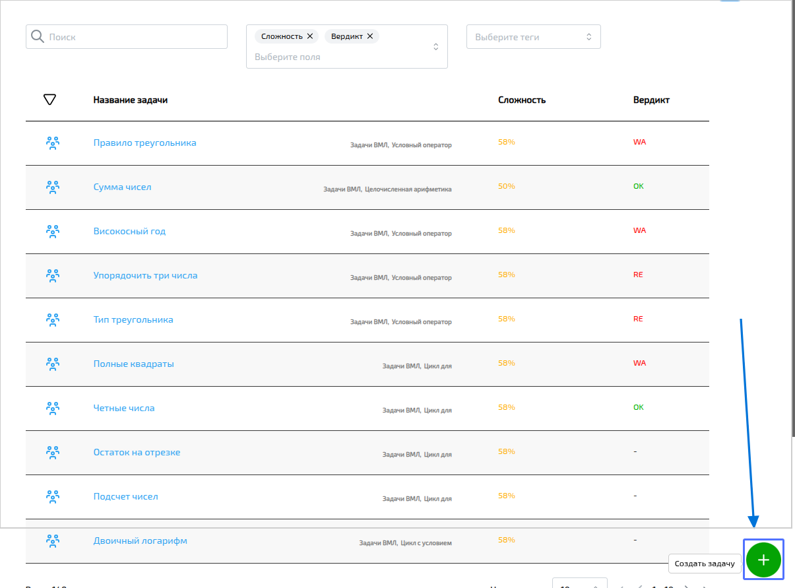
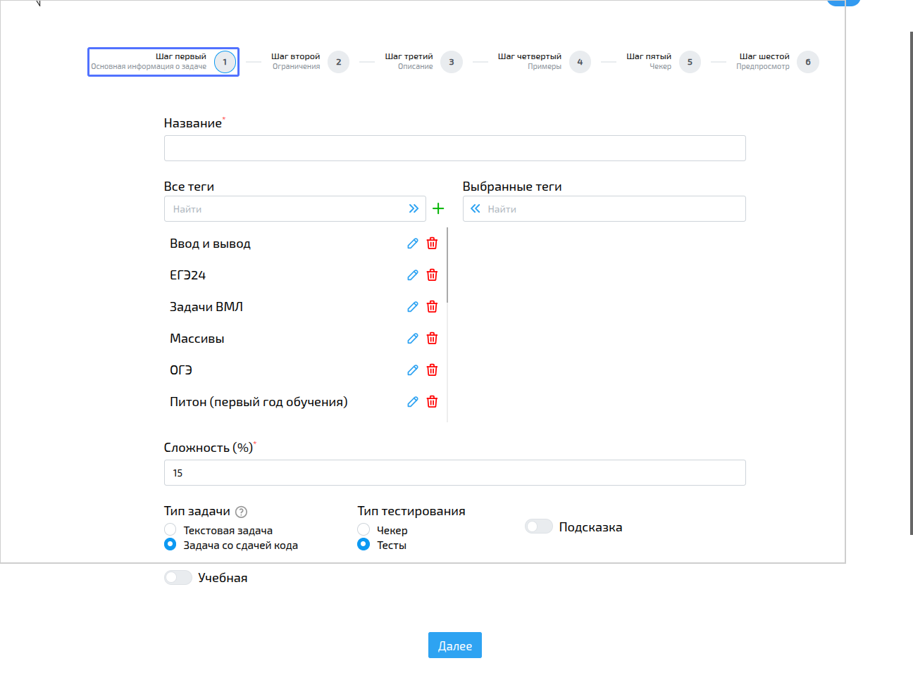
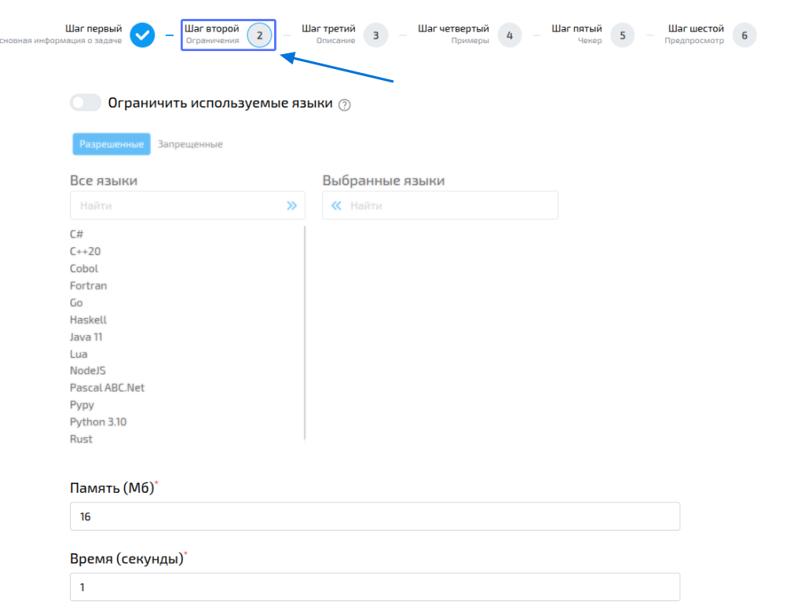
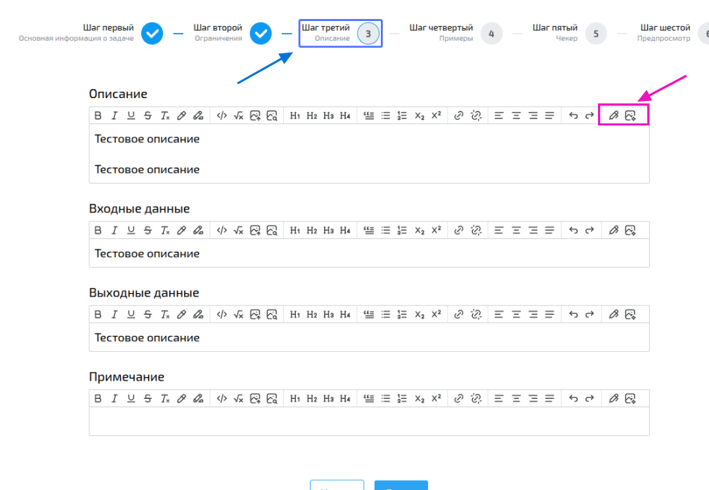
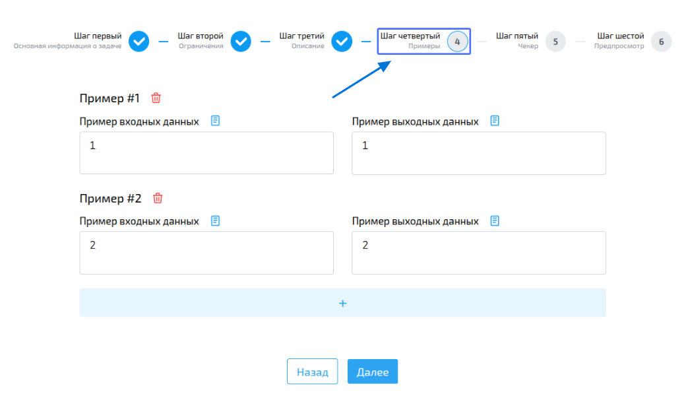
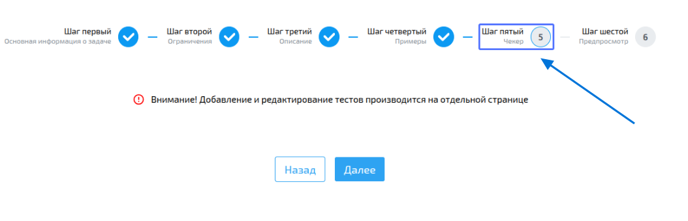
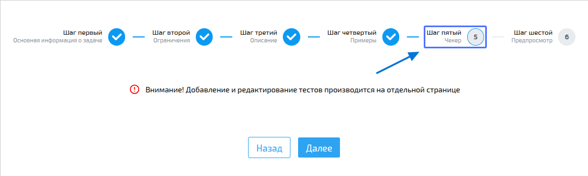
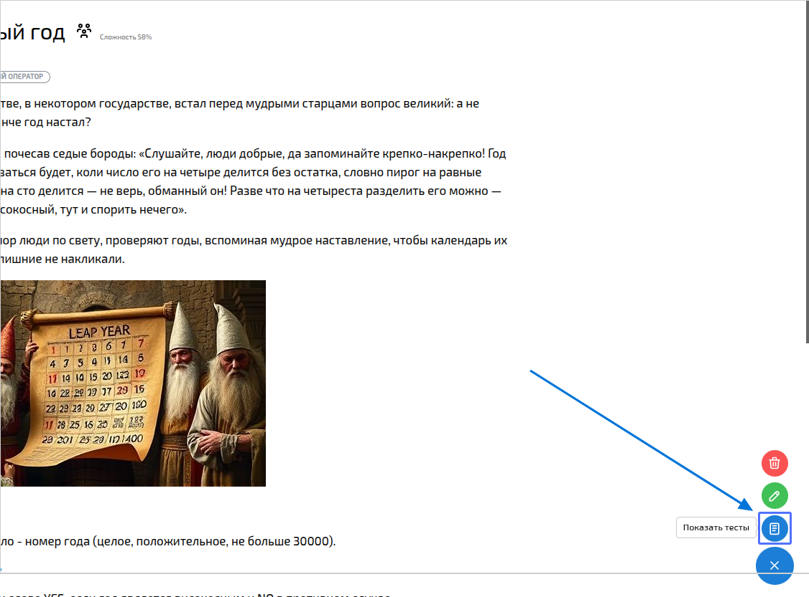
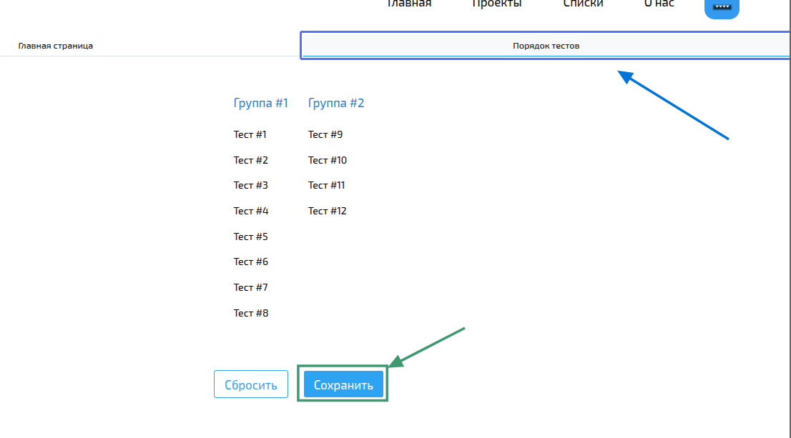

import { Steps } from '@astrojs/starlight/components';
import BugsDisclaimer from '../../../../components/BugsDisclaimer.astro';

<BugsDisclaimer />

## Создание и редактирование задач

Процесс добавления задачи состоит из двух шагов: сначала вы заполняете основную информацию, а затем добавляете тесты.

Интерфейс для редактирования задачи выглядит так же, как и для её создания. Вы можете попасть на страницу редактирования прямо со страницы задачи, нажав на меню в правом нижнем углу.

:::note
Учтите, что **все преподаватели** в вашей организации могут редактировать задачи.
:::

-----

### Шаг 1: Основная информация о задаче
<Steps>
1.  Перейдите на страницу создания задачи.

    

2.  Заполните основные поля:

      * **Название задачи**.
      * **Теги** (выберите хотя бы один).
        :::note
        Если нужного тега нет, вы можете создать его прямо здесь.
        :::
      * **Сложность** (от 1 до 100). Это ваша субъективная оценка.
      * **Тип задачи** и **тип тестирования**.
      * **Подсказка** (выберите, хотите ли вы её добавить).

    

3.  Настройте **ограничения**:

      * Укажите максимальное время выполнения программы в секундах.
      * Укажите максимальный объём памяти в мегабайтах.
      * Вы можете выбрать, какие языки разрешить или запретить для этой задачи.

    

4.  Напишите **описание задачи**, а также **формат входных и выходных данных**. Вы можете добавить примечания.
    :::tip
    В редакторе можно использовать форматирование. А ещё вы можете сгенерировать изображения или улучшить текст с помощью искусственного интеллекта.
    :::

    

5.  Добавьте **примеры** входных и выходных данных. Минимум один, но вы можете добавить сколько угодно с помощью кнопки `+`.

    

6.  Если на шаге 2 вы выбрали [Чекера](#что-такое-чекер) как тип тестирования, перейдите на соответствующую вкладку, чтобы настроить его.

    

7.  Всё готово? Проверьте, что всё выглядит правильно, и нажмите кнопку **«Создать»**.

    

</Steps>

-----

#### Что такое чекер?

**Чекер** — это специальная программа, которая проверяет, соответствует ли ответ пользователя требованиям задачи.

**Как он работает:**

1.  Сначала на вход чекера подаются данные теста, а затем (с новой строки) результат выполнения программы пользователя.
2.  Чтобы отметить ответ как правильный, чекер должен вернуть 1. Любой другой результат будет считаться неверным.

**Процесс проверки с чекером:**

<Steps>
1.  Сначала компилируется ваш чекер.
2.  Затем параллельно запускаются тесты для решения пользователя.
3.  Для каждого теста запускается чекер, который проверяет правильность ответа.
</Steps>

Чтобы добавить или отредактировать чекер, перейдите на страницу создания/редактирования задачи, выберите вкладку **"Чекер"**, выберите язык и вставьте код, а затем сохраните изменения.

-----

### Шаг 2: Редактирование тестов

Перейдите на страницу тестов, чтобы настроить их.

На вкладке **"Главная страница"** вы можете:

1.  Добавлять и удалять **группы тестов**.
2.  Добавлять, удалять и редактировать **отдельные тесты** внутри групп.
3.  Если тест очень большой, он не будет отображаться на странице. В этом случае вы сможете открыть его в новой вкладке как отдельный файл.

На вкладке **"Порядок тестов"** вы можете легко менять порядок тестов и их групп, а также перемещать тесты между группами.

