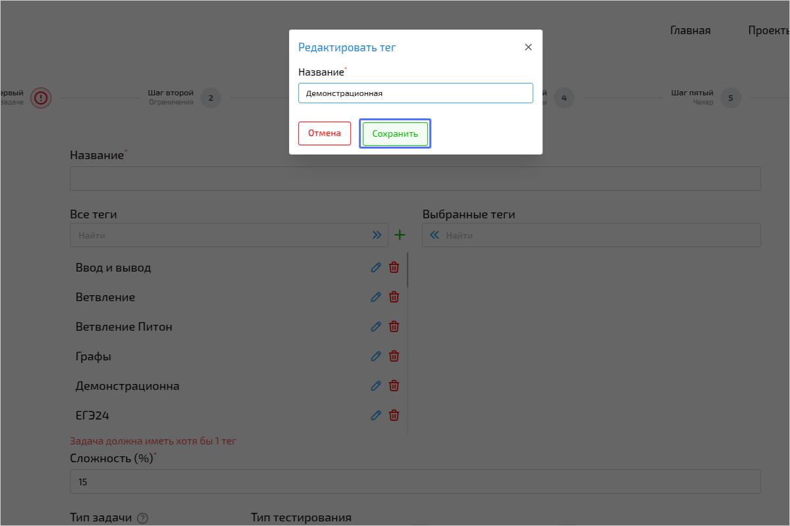
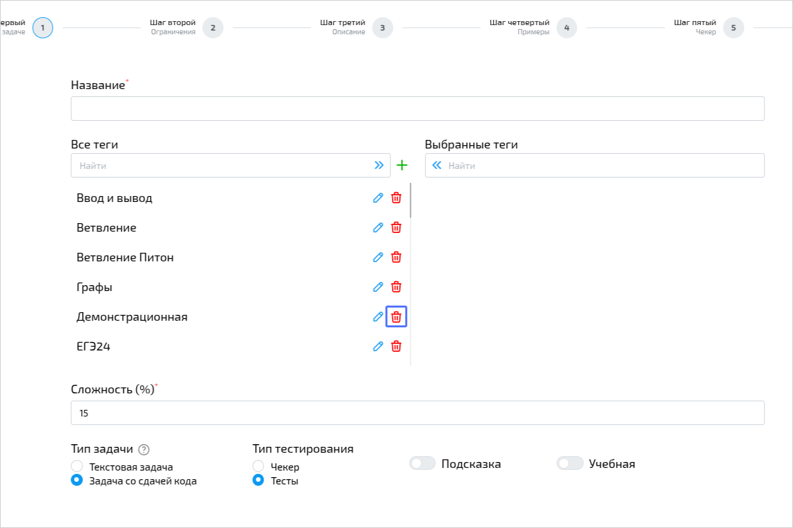

import { Steps, Tabs, TabItem } from '@astrojs/starlight/components';
import BugsDisclaimer from '../../../../components/BugsDisclaimer.astro';

<BugsDisclaimer />

Теги — это созданные учителями метки, помогающие организовывать библиотеку задач/уроков/турниров.

Теги помогают пользователям искать искать вашу задачу/урок/турнир,
так же тег может подсказать пользователю направление в котором стоит размышлять.

## Как использовать теги
### Добавление
<Steps>
1. Откройте меню добавления тегов.

    
2. Введите **название тега** и нажмите кнопку **Добавить**.

    
</Steps>

### Редактирование тега
<Steps>
1. Откройте меню редактирования тегов.

    
2. Измените **название тега** и нажмите кнопку **Сохранить**.

    
</Steps>

### Перемещение тегов
{/* TODO: измениь слово `удаление` */}
<Tabs>
    <TabItem label="Добавление">
        **Нажав на название тега** в левой части вы переместите его в **выбранные**.
        Вы можете выбрать любое количество тегов.

        
    </TabItem>
    <TabItem label="Удаление">
        **Нажав на название тега** в правой части вы уберете его из **выбранных**.
        В верхней части меню вы можете найти кнопку перемещения всех тегов из правой части в левую.

        
    </TabItem>
</Tabs>

### Удаление тегов
<Steps>
1. Нажатием на красную иконку мусорного ведра вы можете удалить тег.

    

2. При нажатии система уточнит, уверены ли вы в ваших действиях

    
</Steps>

:::note
При удалении тега он будет удален из всех задач.
:::

:::danger
Удаление тегов необратимно. Будьте аккуратны при удалении тегов.
:::