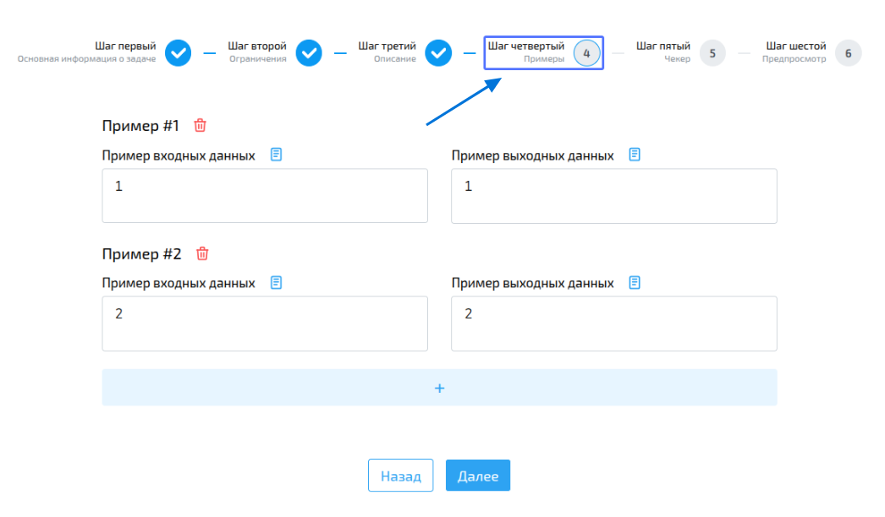
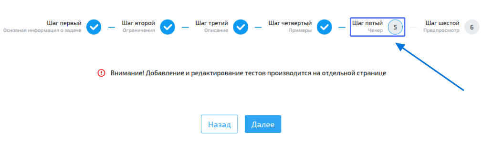
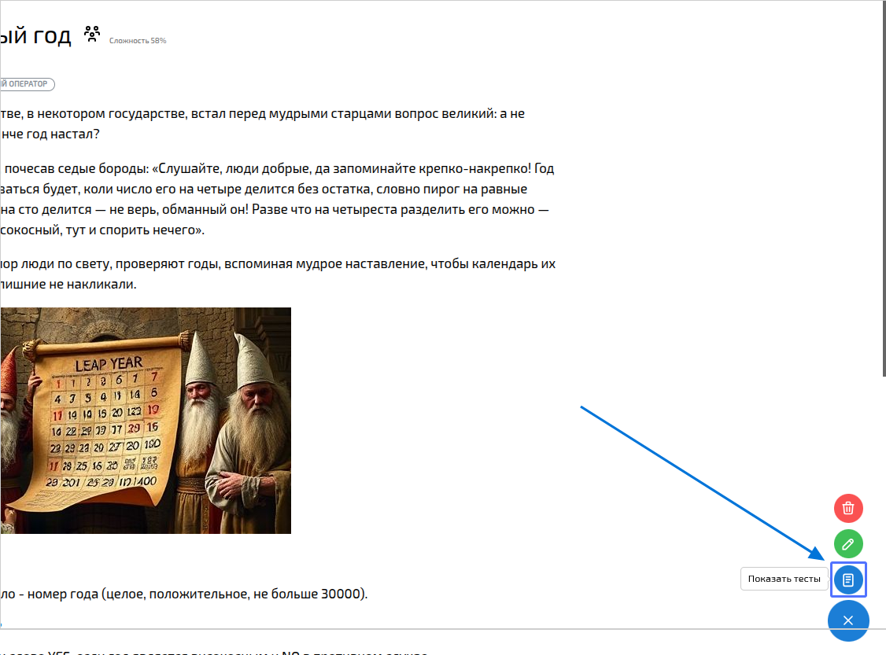
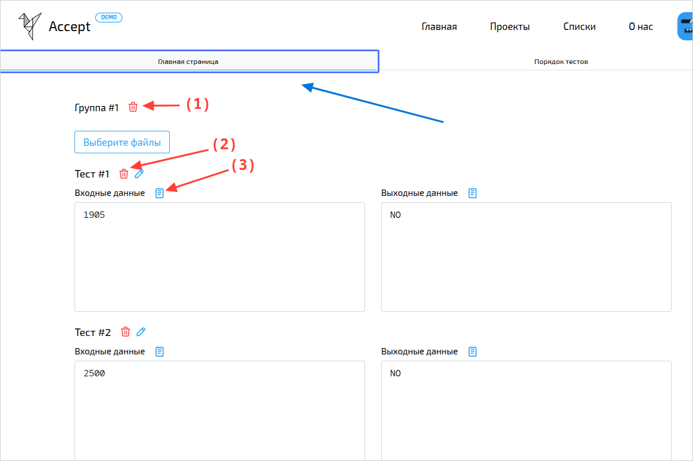
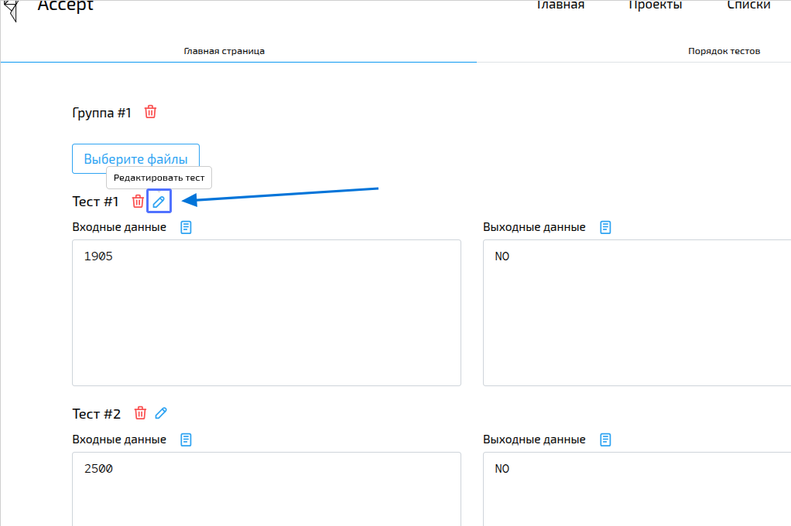
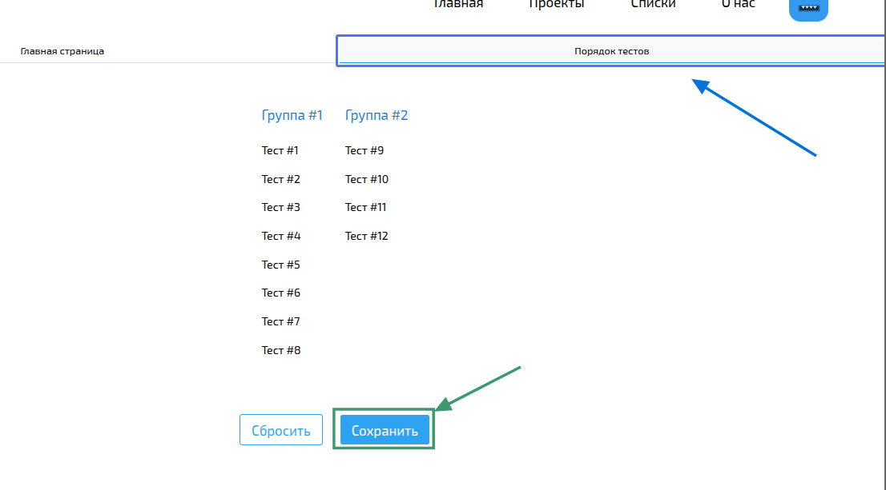

import { Steps } from '@astrojs/starlight/components';
import BugsDisclaimer from '../../../components/BugsDisclaimer.astro';

<BugsDisclaimer />

## Добавление и редактирование задач
Добавление задач происходит в два этапа:
1. Добавление основной информации: название, описание, тип задачи, примеры и т.д.
2. Добавление тестов для задачи.

Соотвественно добавлению и редактирование разбито на две фазы.
Интерфейс редактирования полностью совпадает с интерфейсом добавления задачи.
Доступ к странице редактирования можно получить на странице задачи, в меню в правом нижнем углу.

:::note
ВСЕ учитель внутри организации могут редактировать задачи.
:::

### Добавление основной информации
<Steps>
1. Перейдите на страницу добавления задачи.

    
2. Заполните
    1. Название задачи.
    2. Выберите хотя бы 1 тег.
    :::note
    Вы можете создать тег если не нашли подходящего
    :::
    3. Укажите сложность задачи от 1 до 100 (субъективная оценка).
    4. Выберите тип задачи и тип тестирования.
    5. Выберите хотите ли вы создать подсказку к задаче.

    
3. Выберите ограничения для задачи:
    1. Выберите максимальное время работы программы в секундах
    2. Выберите максимально допустимое использование памяти программой в мегабайтах
    3. Вы можете выбрать ограничение по используемым языкам, либо разрешать, либо запрещать языки.

    
5. Заполните описание задачи, описания входных и выходных данных, примечание.
    :::tip
    Вы можете использовать форматирование в редакторе. Так же доступна генерация картинок и стилизация текста с помощью ИИ.
    :::

    
6. Приведите хотя бы по одному примеру входных и выходных данных. Вы можете добавить любое количество используя кнопку `+`.
    
7. Вкладка чекер отвечает за настройку [чекера](#чекер), если он был выбран как тип тестирования на шаге 2.
    
8. Проверьте, что вся информация отображается корректно и нажмите кнопку **Создать**.
    
</Steps>

#### Чекер
Чекер это программа проверябщая удовлетворяет ли ответ пользователя требованиям задачи.
Чекеру на вход сначала подаются входные данные теста в `stdin`, а затем (с новой строки) результат выполнения программы пользователя.
Чтобы отметить ответ как верный, чекер должен вернуть 1. Любой другой результат от чекера помечает ответ как неверный.

Описание работы чекера для проверки задачи
<Steps>
1. Компиляция чекера происходит перед тестированием попытки.
2. Затем параллельно выполянется тестирование попытки пользователя на группе тестов.
3. Затем для каждого теста запускатеся чекер
</Steps>

Для добавления или редактирования чекера необходимо перейти на страницу добавления или редактирования задачи, перейти на шаг **Чекер**,
выбрать язык чекера и ввести в поле код чекера, затем сохранить изменения задачи.

### Редактирование тестов
Перейдите на страницу тестов

На вкладке **Главная страница** вы можете:
1. добавлять и удалять группы тестов;
2. добавлять, удалять и редактировать тесты в группы тестов;
3. Если тест достаточно большой, то он не будет отображен на странице,
и вам потребуется открыть его в новой вкладке как файл.

На вкладке **Порядок тестов** вы можете менять порядок тестов, менять порядок групп тестов,
перемещать тесты из одной группы в другую.

