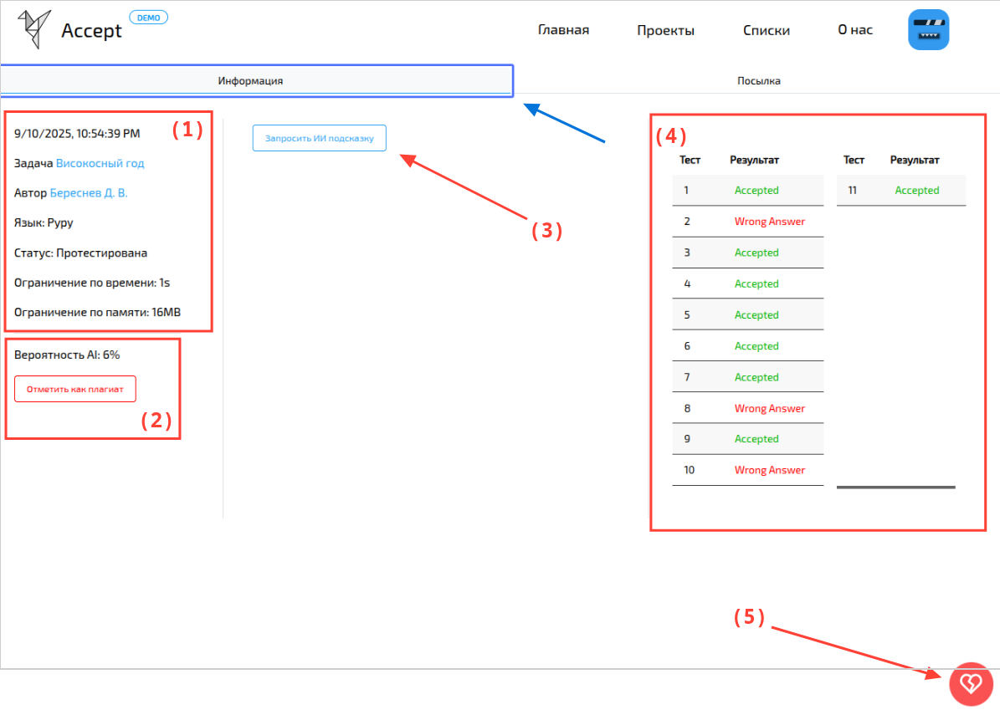

import BugsDisclaimer from '../../../../components/BugsDisclaimer.astro';

<BugsDisclaimer />

Попытки — это второй по важности элемент платформы.
Они позволяют ученикам получать **обратную связь по [задачам](/tasks/overview)**,
а преподавателям — **оценивать** прогресс.

---

## Информация
Вкладка **"Информация"** содержит все данные о попытке, кроме самого кода.

На скриншоте вы видите:
- **(1)** [Основные сведения](#основные-сведения)
- **(2)** [Вероятность AI плагиата](#вероятность-ai-плагиата)
- **(3)** [Подсказка от ИИ](#подсказка-от-ии)
- **(4)** [Таблица результатов](#таблица-результатов)
- **(5)** [Кнопка "Бан/Разбан"](#банразбан) попытки

---

### Основные сведения

Здесь собрана ключевая информация:
* **Дата** отправки.
* **Название задачи** (с ссылкой).
* **Автор** попытки (с ссылкой на его профиль).
* **[Язык](/tasks/attempts/additional/#python) ** решения.
* **Статус** (в очереди, тестируется или протестирована).
* **Ограничения** по времени и памяти.

---

### Вероятность AI-плагиата

Платформа имеет собственную модель, которая анализирует код и определяет,
насколько вероятно, что он был сгенерирован ИИ.
Анализ основан на **синтаксисе** и **семантике** кода.

Преподаватели могут вручную отметить попытку как плагиат,
даже если он не связан с ИИ.

---

### Подсказки от ИИ

Пользователь может запросить подсказку от ИИ,
которая будет создана на основе текста задачи,
кода решения и результатов
([вердиктов](/tasks/attempts/additional/#что-означают-вердикты)) тестов.
Подсказка не даст готовое решение, а **направит пользователя в правильном направлении**.

Если решение уже **верное**,
ИИ предложит, как его **улучшить** — сделать более эффективным или "чистым".

---

### Таблица результатов

Эта таблица показывает, как программа пользователя справилась с **каждым [тестом](/tasks/add-edit#шаг-2-редактирование-тестов)**.
Рядом с каждым тестом указан расширенный **[вердикт](/tasks/attempts/additional/#что-означают-вердикты)**,
чтобы пользователь (и преподаватели) видели, насколько корректно работает код пользователя.
Задача считается решённой, если все тесты имеют вердикт **"Accepted"** (OK).

---

## Посылка
На вкладке **"Посылка"** вы можете увидеть свой отправленный код.
Для популярных языков предусмотрена удобная подсветка синтаксиса.

---

## Бан/Разбан

Преподаватели могут **забанить** попытку,
если она нарушает правила, например, из-за неспортивного поведения или плагиата.
При этом указывается причина.

Забаненная попытка **не учитывается** в итоговых таблицах результатов,
но остаётся доступной для просмотра.
Автор получает уведомление о том, что его попытка забанена.
При необходимости, преподаватель может отменить бан.