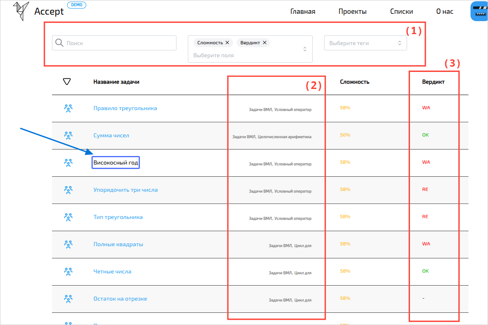
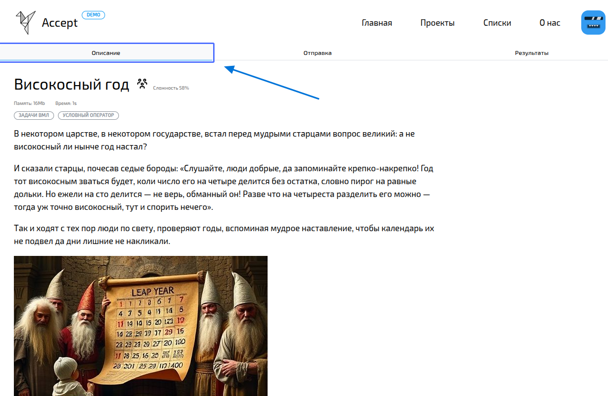
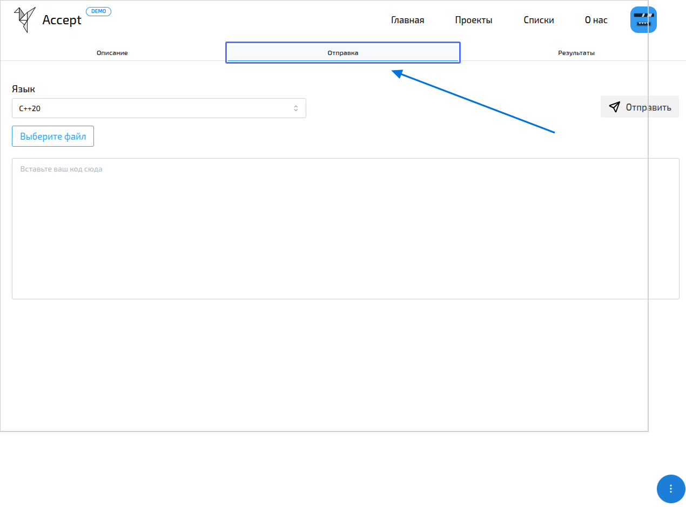
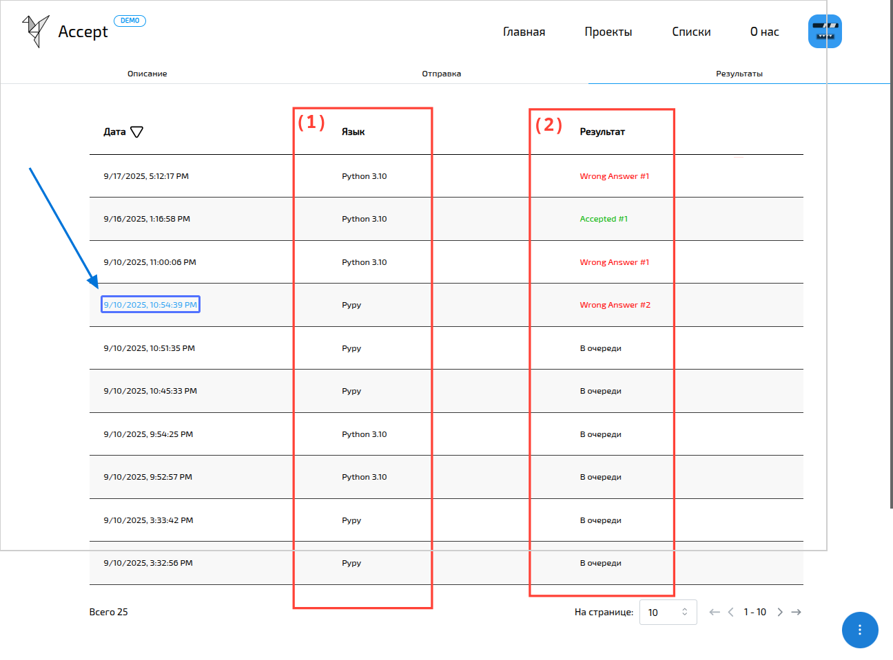
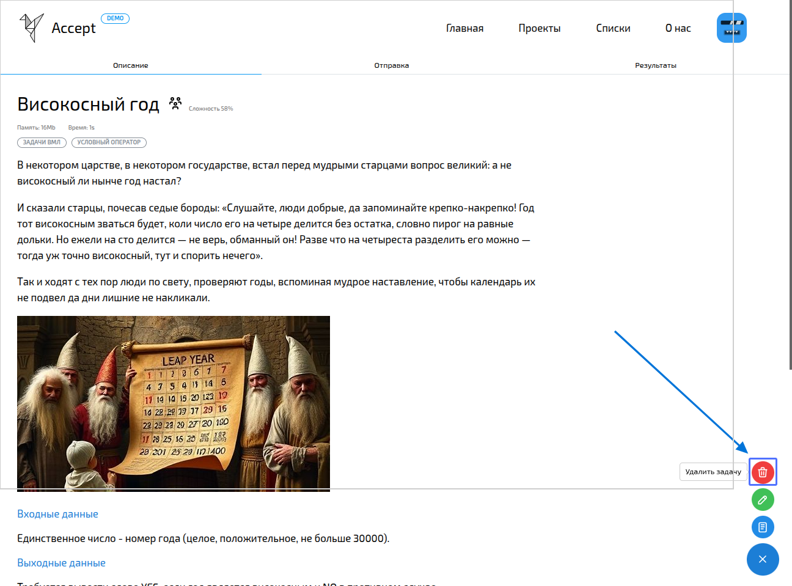
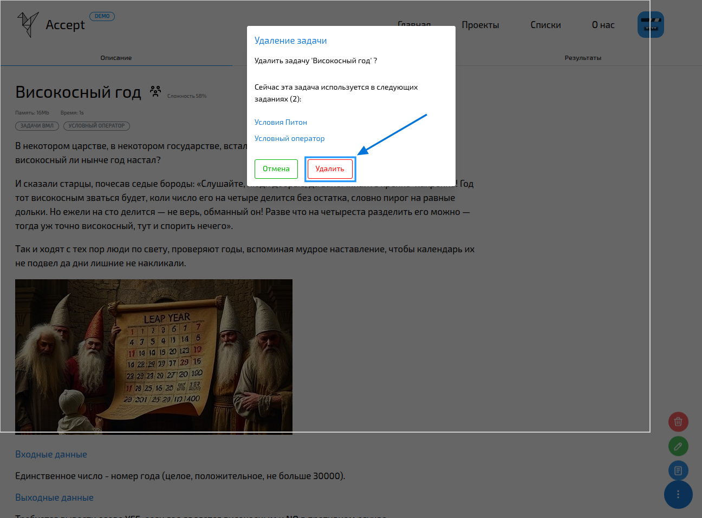

import { Steps } from '@astrojs/starlight/components';
import BugsDisclaimer from '../../../components/BugsDisclaimer.astro';

<BugsDisclaimer />

Задачи — это главный элемент платформы Accept.
Именно из них строятся [уроки](/assignments/overview), [турниры](/tournaments/overview) и [курсы](/courses/overview).
Преподаватели могут свободно **создавать, редактировать и удалять** любые задачи в рамках своей организации.

-----

## Список задач

На этой странице вы увидите **все доступные задачи**. Если вы преподаватель, здесь же вы сможете добавлять новые.

Чтобы найти нужную задачу, используйте **поиск** по названию, имени автора или тегам. Также вы можете настроить отображение таблицы, включая или выключая нужные столбцы.

-----

## Страница задачи: три важные вкладки

Когда вы открываете задачу, перед вами три вкладки: [Описание](#описание), [Отправка](#отправка) и [Результаты](#результаты).

Преподаватели могут не только решать задачу, но и **редактировать её** или **удалять**, а также изменять тесты.

Если задача относится к [турниру](/tournaments/overview) или [уроку](/assignments/overview), появятся дополнительные элементы, например, таймер до конца соревнования и панель с вашими результатами.

:::note
Если вы не вошли в систему, вам будет доступна только вкладка [Описание](#описание).
:::

### Описание

Здесь находится вся информация, которая вам нужна для решения. Страница состоит из нескольких блоков:

1.  **Заголовок, теги, автор** и **ограничения** по времени и памяти.
2.  **Само описание задачи**.
3.  **Примеры** входных и выходных данных задачи.
4.  **(Необязательно)** Примечание.

### Отправка

На этой вкладке вы можете отправить свою [попытку](/tasks/attempts/overview). Просто загрузите файл или напишите код прямо в окне.

Мы поддерживаем множество популярных языков программирования, таких как Python, C++, Pascal, C\#, Java и [многие другие](/tasks/attempts/languages).

### Результаты

Здесь вы увидите **результаты всех своих [посылок](/tasks/attempts/overview)**. Чтобы посмотреть подробности, просто нажмите на дату отправки.

:::tip
(1) Полный список языков, которые мы поддерживаем, находится на этой [странице](/tasks/attempts/additional#языки-которые-мы-поддерживаем).

(2) Если вы не уверены, что означают вердикты, посмотрите их расшифровку здесь: [вердикты попыток](/tasks/attempts/additional#что-означают-вердикты).
:::

-----

## Создание и редактирование задач

Узнать, как создавать и редактировать задачи можно на специальной [странице](/tasks/add-edit).

-----

## Как удалить задачу

Преподаватели могут удалять задачи. Когда вы удаляете задачу, она исчезает из всех [уроков](/assignments/overview), [турниров](/tournaments/overview) и [курсов](/courses/overview), где использовалась.

:::note
Если удалённая задача была единственной в каком-то уроке, турнире или курсе, сам курс останется — просто в нём не будет задачи.
:::

:::danger
Будьте очень внимательны: **удаление необратимо\!**
:::

